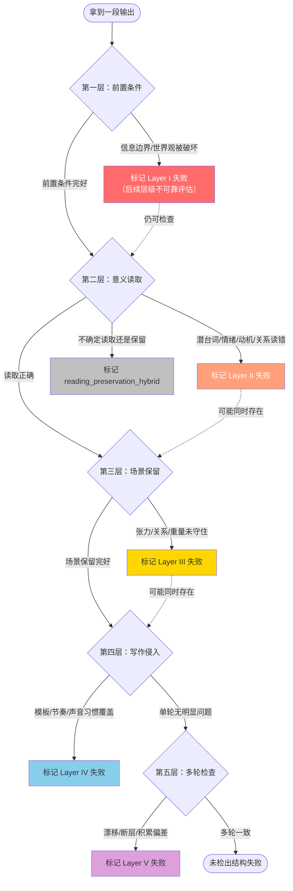

# 中文虚构对话失败图谱

面向大语言模型虚构和角色扮演对话的失败模式分类体系，以中文场景为中心。

---

## 这是什么

一个命名和分类 AI 生成角色扮演对话中结构失败的分类体系——那种输出局部流畅但让有经验读者感觉不对的情况。

每个失败类型包含：
- 清晰定义
- 可观察标准（清单格式）
- 简单示例展示哪里出错
- 与相近标签的边界讨论（针对容易混淆的标签对）

这不是基准测试数据集，也不是带完整场景标注的案例集。它是用于识别和讨论失败模式的参考分类体系。

---

## 诊断流程

诊断时按层级顺序检查。第一层是前置条件：如果场景基础结构已经坏了，后续层级的判断不可靠。

> **注意：** 多个层的失败可以同时存在。Layer I 失败后仍可继续检查后续层，但结果需要谨慎解读。

---

## 失败层级概览

| 层级 | 名称 | 定义 | 标签数 | 详细内容 |
|------|------|------|--------|----------|
| **I** | 前置条件 | 场景基础结构失败（信息边界、世界规则） | 8 | [→ 查看](layers/layer-1-preconditions.md) |
| **II** | 意义读取 | 模型未理解场景含义（潜台词、情绪、关系逻辑） | 8 | [→ 查看](layers/layer-2-semantic-reading.md) |
| **III** | 场景保留 | 模型理解但在生成时未能保持场景压力 | 25 | [→ 查看](layers/layer-3-scene-preservation.md) |
| **IV** | 写作侵入 | 模型默认写作习惯覆盖场景特定需求 | 16 | [→ 查看](layers/layer-4-writing-intrusion.md) |
| **V** | 多轮失败 | 需要多轮视角才能可靠诊断的失败（连续性、累积） | 10 | [→ 查看](layers/layer-5-multi-turn.md) |
| — | 底层倾向 & 跨层标签 | 底层驱动偏向 + 跨层诊断辅助标签 | 6 + 2 | [→ 查看](layers/cross-layer.md) |

---

## 快速参考表

### 第一层：前置条件（8 个标签）

| 标签 | 中文名 | 一句话定义 |
|------|--------|-----------|
| `reference_boundary_failure` | 指涉边界失败 | 越权书写用户角色的行为或内心 |
| `pronoun_role_confusion` | 人称角色混淆 | NPC 之间的属性、行为归属贴错 |
| `omniscience_leak` | 全知泄露 | 角色行为泄露了不应拥有的系统设定信息 |
| `perspective_slippage` | 视角滑动 | 叙事视角从角色内部滑向全知或回溯叙述者 |
| `worldview_constraint_error` | 世界观约束错误 | 用现代推理框架替代场景世界的概念体系 |
| `safety_alignment_interference` | 安全对齐干扰 | 安全训练导致反派被"去势"，威胁感削弱 |
| `character_capability_boundary_error` | 角色能力边界错误 | 角色展现超出其背景所允许的知识或分析能力 |
| `alternate_version_confusion` | 版本混淆 | 混入不同改编版本的标志性台词或人物特征 |

### 第二层：意义读取（8 个标签）

| 标签 | 中文名 | 一句话定义 |
|------|--------|-----------|
| `subtext_blindness` | 潜台词盲视 | 将对话按字面解读，未识别隐含含义 |
| `ambiguity_collapse` | 模糊性塌缩 | 多层意义被过早解决为单一解释 |
| `relationship_logic_blindness` | 关系逻辑盲视 | 未识别特定关系如何改变对话含义 |
| `emotion_misread` | 情绪误读 | 分配错误的情绪类型或强度 |
| `motivation_misread` | 动机误读 | 情绪大致对但误认角色真正的目标 |
| `irony_blindness` | 反语盲视 | 未识别讽刺、反语或调侃结构 |
| `tonal_whiplash` | 语调突变 | 引入与场景基调不一致的语调元素 |
| `deflection_blindness` | 回避盲视 | 未识别话语何时是防御性操作 |

### 第三层：场景保留（25 个标签）

| 子类 | 标签 | 中文名 | 一句话定义 |
|------|------|--------|-----------|
| III-A 关系 | `relationship_flattening` | 关系扁平化 | 特殊关系被改写为普通版本 |
| | `symmetry_bias` | 对称性偏向 | 给不该回应的一方补对等回应 |
| | `specialness_dilution` | 独特性稀释 | 不可替代性被写成一般化的重要性 |
| | `therapist_mode_intrusion` | 治疗师模式侵入 | 角色突然用咨询式语言做情绪调解 |
| | `ooc_modernization` | 人物现代化出戏 | 引入现代情感教育话语框架 |
| | `seduction_logic_error` | 勾引逻辑错误 | 追逐的不对称性被破坏 |
| | `manipulation_blindness` | 操控盲视 | 算计性行为被当作真诚来回应 |
| | `consent_flattening` | 同意扁平化 | 权力不平衡被简化为清晰的同意/拒绝 |
| III-B 心理 | `overcoherent_characterization` | 过度连贯塑造 | 角色过于稳定一致，像规格说明书 |
| | `premature_affective_closure` | 情绪过早收束 | 情绪矛盾在场景到位前被讲干净 |
| | `desire_overlegibility` | 欲望过度可读 | 半隐的欲望被过早翻译成明文 |
| | `self_protective_friction_loss` | 自我保护摩擦缺失 | 脆弱暴露时缺少应有的犹豫和包装 |
| | `impulse_recontainment` | 冲动再收容 | 失控被过早整理回条理 |
| III-C 重量 | `consequence_avoidance` | 后果回避 | 重话说出后重量没有停留 |
| | `impact_soft_landing` | 冲击软着陆 | 后果落地那一刻接收方式太软 |
| | `tension_premature_resolution` | 张力过早收束 | 张力没活够就被收走 |
| | `defensive_positive_drift` | 防御性正向漂移 | 不该通风的场景被悄悄塞入暖意 |
| III-D 身体 | `action_dialogue_mismatch` | 动作台词错位 | 身体动作与语言输出矛盾且未被承认 |
| | `blocking_continuity_error` | 走位连续性错误 | 角色位置在多拍间不一致 |
| | `microreaction_mechanization` | 微反应机械化 | 同一套微信号库存被跨情绪套用 |
| | `touchgrammar_error` | 触碰语法错误 | 触碰不符合场景的关系逻辑和权力动态 |
| | `forced_verbalization` | 强制言语化 | 本应隐性运作的动态被明文说出 |
| | `silence_misread` | 沉默误读 | 有意义的沉默被当作需要填补的间隙 |
| | `over_narrated_silence` | 过度叙述的沉默 | 沉默被从外部描述和解释而非呈现 |
| | `pause_timing_error` | 停顿时机错误 | 停顿被放在结构上错误的位置 |

### 第四层：写作侵入（16 个标签）

| 子类 | 标签 | 中文名 | 一句话定义 |
|------|------|--------|-----------|
| IV-A 模板 | `narrative_template_intrusion` | 叙事模板侵入 | 不同场景反复出现相似骨架 |
| | `predictable_rhythm_exposure` | 可预测节律暴露 | 段落节律太容易被认出 |
| | `webnovel_register_contamination` | 网文语域污染 | 套用网文库存短语和腔调 |
| | `scene_pacing_distortion` | 场景节奏失调 | 推进速度与场景压力不匹配 |
| | `cinematic_time_dilation` | 电影式时间膨胀 | 一拍的事被写成慢镜头 |
| | `rhythm_homogenization` | 节奏同质化 | 不同类型场景用同一个内部时钟 |
| | `echo_dramatization` | 回扣戏剧化 | 回扣和呼应频率超出场景积累 |
| | `genre_convention_violation` | 类型惯例错配 | 从错误类型引入结构性惯例 |
| IV-B 质感 | `descriptive_substitution_for_experience` | 描述替代体验 | 在旁边描写体验而非让读者停留其中 |
| | `texture_substituting_for_substance` | 质感替代实质 | 氛围和质感代替了真正的推进 |
| | `microreaction_oversegmentation` | 微反应过度切分 | 一个自然反应被拆成太多单元 |
| | `over_stylized_line_breaking` | 过度风格化换行 | 换行被过度用来制造氛围 |
| | `dialogue_overfunctionalization` | 台词过度功能化 | 每句台词都太有用了 |
| | `voice_homogenization` | 声音同质化 | 不同角色的说话方式太像 |
| | `emotional_range_limitation` | 情绪范围局限 | 大量不同情绪坍缩进窄小的可识别库 |
| | `user_intent_misalignment` | 用户意图错位 | 模型偏好的场景走向覆盖了用户铺垫 |

### 第五层：多轮失败（10 个标签）

| 标签 | 中文名 | 一句话定义 |
|------|--------|-----------|
| `error_accumulation` | 错误积累 | 前几轮的错误在后续轮次上继续延伸 |
| `drift_without_correction` | 漂移未纠正 | 关键参数在多轮中逐渐偏移 |
| `scene_signal_blindness` | 场景信号盲视 | 用户的转向信号未被识别 |
| `turn_continuity_error` | 轮次连续性错误 | 前一轮明确建立的信息被遗忘或矛盾 |
| `emotional_state_reset` | 情绪状态重置 | 情绪状态在轮次间被无理由重置 |
| `spatial_blocking_error` | 走位积累错误 | 跨多轮的空间位置失去追踪 |
| `escalation_miscalibration` | 升级误校准 | 情绪升级节奏与内容支撑不匹配 |
| `topic_persistence_error` | 话题持续性错误 | 话题线被不当丢弃或过度延伸 |
| `context_overdeployment` | 上下文过度部署 | 过度征用早期上下文，回扣过于刻意 |
| `voice_drift` | 声音漂移 | 角色声音在多轮中逐渐失去辨识度 |

### 底层倾向 & 跨层标签

| 标签 | 类型 | 一句话定义 |
|------|------|-----------|
| `reader_comfort_alignment` | 倾向 | 输出更像在照顾读者可消费性 |
| `affect_manageability_bias` | 倾向 | 把难承受的情感改写成更易消化的东西 |
| `darkness_intolerance` | 倾向 | 不愿在冷/黑/难的状态里待太久 |
| `aesthetic_obedience_bias` | 倾向 | 过度服从"好看""有成品感"的要求 |
| `complexity_avoidance` | 倾向 | 将复杂多线程状态简化为更易处理的版本 |
| `closure_drive` | 倾向 | 强烈倾向要把事情"说完""收住" |
| `supportive_but_wrong` | 跨层 | 情感上正确但背叛了场景实际结构 |
| `reading_preservation_hybrid` | 跨层 | 无法确认失败在读取层还是保留层 |

---

## 常见共现模式

实际诊断中，以下标签经常成组出现。识别这些集群有助于快速定位问题的根源。

### 集群 1：「温柔地杀死场景」

最常见的失败模式。输出读起来温暖、成熟、有分寸，但场景的真实重量被消解了。

| 核心标签 | 常见伴随 | 底层倾向 |
|---------|---------|---------|
| `tension_premature_resolution` | `defensive_positive_drift`, `impact_soft_landing` | `reader_comfort_alignment`, `affect_manageability_bias` |
| `therapist_mode_intrusion` | `relationship_flattening`, `ooc_modernization` | `darkness_intolerance` |

典型表现：冲突刚起来就被安抚话术接住，对峙变成沟通，沉重变成暖心。

### 集群 2：「所有人说话像同一个人」

声音和节奏层面的同质化。

| 核心标签 | 常见伴随 |
|---------|---------|
| `voice_homogenization` | `predictable_rhythm_exposure`, `narrative_template_intrusion` |
| `emotional_range_limitation` | `microreaction_mechanization` |

典型表现：不同角色用相似句式、相似节奏、相似情绪颗粒度说话。跨场景对比尤为明显。

### 集群 3：「欲望太快到达」

情感和欲望在还没积累够的时候就被翻译明白了。

| 核心标签 | 常见伴随 |
|---------|---------|
| `desire_overlegibility` | `forced_verbalization`, `self_protective_friction_loss` |
| `premature_affective_closure` | `symmetry_bias`, `seduction_logic_error` |

典型表现：角色在不该坦白的时候坦白，不该对等的关系被补成对等，追逐的不对称消失。

### 集群 4：「安全训练的连锁反应」

`safety_alignment_interference` 作为 Layer I 失败，常触发后续层的连锁问题。

| 起始标签 | 连锁触发 |
|---------|---------|
| `safety_alignment_interference` | → `relationship_flattening`（危险关系被软化） |
| | → `consent_flattening`（强制性被框架为自愿） |
| | → `manipulation_blindness`（操控被当作真诚） |

典型表现：反派不够坏、危险关系不够危险、权力不对等被悄悄中和。

### 集群 5：「写作惯性覆盖」

模型不是读错了场景，而是用自己偏好的写法覆盖了场景需要的写法。

| 核心标签 | 常见伴随 |
|---------|---------|
| `texture_substituting_for_substance` | `cinematic_time_dilation`, `scene_pacing_distortion` |
| `user_intent_misalignment` | `genre_convention_violation`, `echo_dramatization` |
| | `over_stylized_line_breaking`, `webnovel_register_contamination` |

典型表现：氛围很满但什么都没推进，用户在铺的方向被模型的偏好替换。

---

## 严重度参考

不同层级的失败对场景的破坏程度不同。以下是一个粗略的严重度框架，供诊断时参考优先级。

| 严重度 | 影响 | 对应层级 | 说明 |
|--------|------|---------|------|
| **致命** | 场景前提坍塌，后续无法评估 | Layer I | 信息边界、世界观被破坏。必须优先修复。 |
| **严重** | 场景方向偏离，角色行为失去内在逻辑 | Layer II | 意义读错了——后续所有生成都建立在错误基础上。 |
| **中等** | 场景可辨认但质量显著下降 | Layer III | 读对了但没守住。张力流失、关系扁平、重量消解。 |
| **轻微** | 场景基本成立，但写作品质受损 | Layer IV | 模板化、节奏同质、声音单一。熟读者才能感知。 |
| **累积** | 单轮不明显，多轮后场景漂移 | Layer V | 需要回溯才能发现。单独不致命但长期腐蚀场景。 |

> **注意：** 这是粗略框架而非严格排序。一个 Layer IV 的 `user_intent_misalignment` 可能比某些 Layer III 失败更具破坏性，因为它直接覆盖了用户的创作意图。严重度取决于具体场景和具体标签。

---

## 其他资源

- [标注指南](docs/annotation-guide.md) — 使用本分类体系进行标注时的操作参考
- [结构化数据](taxonomy.json) — 全部标签的 JSON 格式，便于程序化使用
